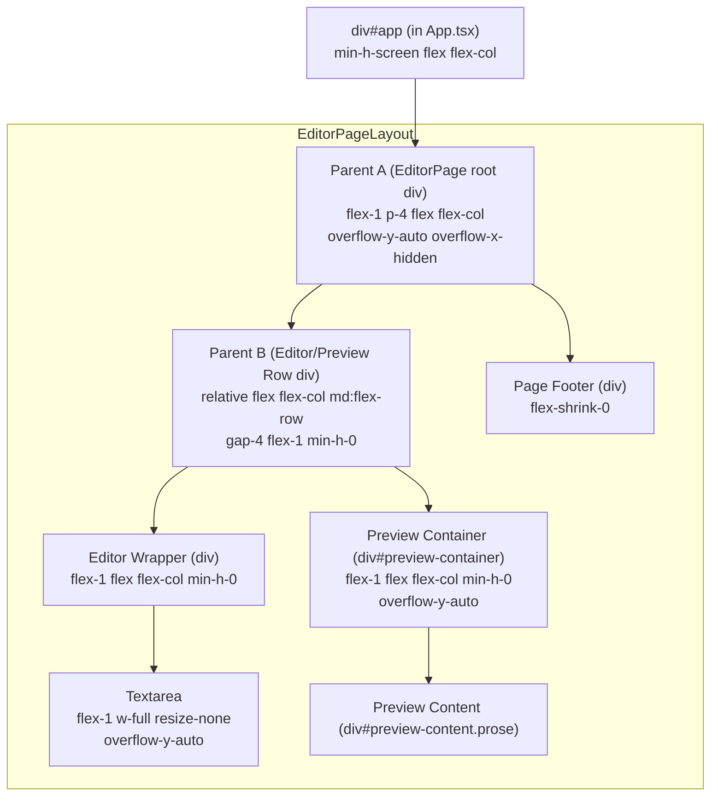

# EditorPage.tsx Layout Explanation

This document explains the intended flexbox layout and scrolling behavior for the `EditorPage.tsx` component in the Nulldown application.

## Goal

The primary goal is to have a main application area that fills the viewport (minus any global header/footer from `App.tsx`). Within this area, the `EditorPage` should display:
1.  An editor pane (textarea).
2.  A preview pane (rendered Markdown).
3.  A footer section with action buttons.

When content in either the editor or preview pane exceeds the vertical space allocated to it, that specific pane should scroll internally. The overall page (specifically, the main content area of `EditorPage`) should also scroll if the combined height of the editor/preview row and the page-specific footer exceeds the available space.

## HTML Structure and Tailwind CSS Classes (Simplified)

Below is a conceptual breakdown of the nested `div` structure and the key Tailwind classes intended to achieve the layout. Parent A, B, etc., refer to the discussion during debugging.

## Key Tailwind Classes and Their Intended Effects:

1.  **`div#app` (from `App.tsx`)**: `min-h-screen flex flex-col`
    *   Ensures the app takes at least the full viewport height.
    *   `flex-col` allows a header, main content (taken by `EditorPage`), and footer to stack vertically.

2.  **Parent A (`EditorPage` root `div`)**: `flex-1 p-4 flex flex-col overflow-y-auto overflow-x-hidden`
    *   `flex-1`: Takes up available vertical space within `div#app` not used by other global elements (if any).
    *   `flex flex-col`: Its children (Parent B and PageFooter) will stack vertically.
    *   `overflow-y-auto overflow-x-hidden`: This div becomes the **main scroll container** for the content of `EditorPage`. If Parent B + PageFooter is taller than the space Parent A gets, Parent A will scroll.

3.  **Parent B (Editor/Preview Row `div`)**: `relative flex flex-col md:flex-row gap-4 flex-1 min-h-0`
    *   `flex-1`: Takes up available vertical space within Parent A (not used by PageFooter).
    *   `min-h-0`: Crucial for flex children; allows this div to shrink below its intrinsic content size if Parent A is constrained.
    *   `md:flex-row`: Stacks editor/preview side-by-side on medium screens and up; `flex-col` (default) stacks them vertically on small screens.
    *   `relative`: Added for potential absolute positioning of children if needed, but not strictly necessary for this flex layout to work as intended.

4.  **Editor Wrapper (`div`)**: `flex-1 flex flex-col min-h-0`
    *   `flex-1`: Takes its share of space within Parent B (either width if Parent B is a row, or height if Parent B is a column).
    *   `flex flex-col`: Its child (the textarea) will stack vertically (though it's the only child).
    *   `min-h-0`: Allows it to shrink.

5.  **Textarea**: `flex-1 w-full resize-none ... overflow-y-auto`
    *   `flex-1`: Takes up all available vertical space within its Editor Wrapper.
    *   `w-full`: Takes full width.
    *   `overflow-y-auto`: The textarea itself handles scrolling its text content if it exceeds its computed height.

6.  **Preview Container (`div#preview-container`)**: `flex-1 flex flex-col ... p-4 overflow-y-auto min-h-0`
    *   `flex-1`: Takes its share of space within Parent B.
    *   `flex flex-col`: Its child (`#preview-content`) will be a flex item.
    *   `overflow-y-auto`: This div should scroll if its child (`#preview-content`) becomes taller than the height allocated to `preview-container` by Parent B.
    *   `min-h-0`: Allows it to shrink.

7.  **Preview Content (`div#preview-content.prose`)**: No specific height or flex properties. It should take the natural height of the rendered Markdown.

8.  **Page Footer (`div`)**: `flex-shrink-0`
    *   Prevents the footer from shrinking if space is tight. It will take its natural height.

## Expected Scrolling Behavior:

*   **Internal Pane Scrolling:**
    *   The `textarea` should scroll its own text content internally.
    *   The `div#preview-container` should scroll the `div#preview-content` (the rendered Markdown) internally.
*   **Main Page Scrolling:**
    *   If the combined height of the `Editor/Preview Row` (Parent B) and the `Page Footer` is greater than the height Parent A receives from the overall app layout, then Parent A (the main content area of `EditorPage`) should scroll, showing a vertical scrollbar for the whole central section of the page.

## Debugging Notes (If Not Working):

If the preview pane (or editor) causes the entire page to scroll instead of scrolling internally, and its computed height is very large (e.g., matching its content height), it means its height is not being constrained by its parent flex container (`Parent B`). This typically implies that `Parent B` itself is not getting a properly constrained height from `Parent A`, or there's an issue with `flex-basis`, `min-height`, or `overflow` properties higher up or on these elements that breaks the chain of constraints.

Key things to check in browser dev tools:
*   Computed `height` of `Parent A`, `Parent B`, `Editor Wrapper`, and `Preview Container`.
*   Computed `overflow` and `min-height` properties for these elements.

The goal is for `Preview Container` and `Textarea` to have a computed height based on the space allocated by `Parent B`, not based on their own content length. If they get such a constrained height, their `overflow-y: auto` will function correctly. 