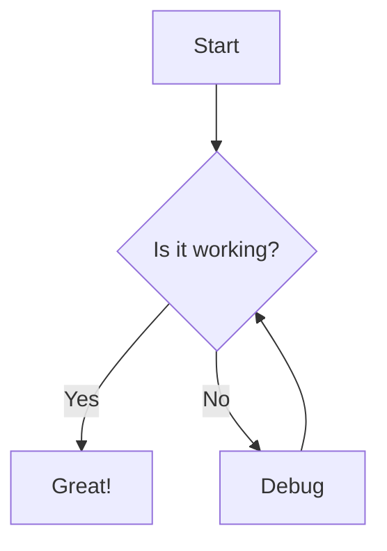

# Nulldown

A minimalist web application for creating and sharing temporary text snippets, often called "drops". Paste your text, get a unique link, and share it.

## Features

- Create text drops with a simple interface.
- Automatically generate unique, short URLs for sharing.
- Support for rendering **Mermaid diagrams**, **Markdown tables**, and **LaTeX math expressions**.
- Enhanced Markdown formatting with syntax highlighting.
- Drops are stored temporarily using Cloudflare R2.
- Clean, responsive UI built with Tailwind CSS.
- Copy-to-clipboard functionality for easy sharing.

## Markdown Support

Nulldown supports an enhanced version of Markdown with the following features:

### Basic Markdown

- Headings (# h1, ## h2, etc.)
- Text formatting (**bold**, *italic*, ~~strikethrough~~)
- Lists (ordered and unordered)
- Links and images
- Code blocks with syntax highlighting
- Blockquotes

### Advanced Features

#### Mermaid Diagrams

Create diagrams using Mermaid syntax. Example:

```markdown

```

#### Markdown Tables

Create tables using standard Markdown syntax:

```markdown
| Header 1 | Header 2 | Header 3 |
| -------- | -------- | -------- |
| Cell 1   | Cell 2   | Cell 3   |
| Cell 4   | Cell 5   | Cell 6   |
```

#### LaTeX Math Expressions

Add mathematical expressions using LaTeX syntax:

- Inline math: `$E = mc^2$`
- Block math:
  ```markdown
  $$
  \frac{d}{dx}\left( \int_{0}^{x} f(u)\,du\right)=f(x)
  $$
  ```

## Getting Started

### Prerequisites

- Node.js (v18 or later recommended)
- npm or yarn
- Cloudflare Account (for R2 integration and deployment)

### Environment Variables

You'll need to set up Cloudflare R2 and configure the necessary environment variables (e.g., in a `.env` file for local development via Vite or in your Cloudflare Pages/Workers settings):

- `R2_BUCKET_NAME`
- `R2_ACCOUNT_ID`
- `R2_ACCESS_KEY_ID`
- `R2_SECRET_ACCESS_KEY`
- `PUBLIC_BASE_URL` (The base URL where the application is hosted, e.g., `https://your-app.pages.dev`)

Refer to the [Cloudflare R2 documentation](https://developers.cloudflare.com/r2/) for instructions on setting up a bucket and obtaining credentials.

### Local Development

1.  Clone the repository:
    ```bash
    git clone <your-repo-url>
    cd Nulldown
    ```
2.  Install dependencies:
    ```bash
    npm install
    # or
    yarn install
    ```
3.  Set up your `.env` file with the Cloudflare R2 environment variables.
4.  Run the development server using Vite:
    ```bash
    npm run dev
    # or
    yarn dev
    ```

Open the URL provided by Vite (usually [http://localhost:5173](http://localhost:5173)) with your browser. The local development server uses mock APIs with `localStorage` by default, so R2 credentials are not strictly needed for basic UI development, but are required for testing the production build locally (`npm run build && npm run preview`).

## Deployment

The application is designed for deployment on [Cloudflare Pages](https://pages.cloudflare.com/).

1.  Push your code to a Git repository (GitHub, GitLab, Bitbucket).
2.  Create a new Cloudflare Pages project and connect it to your repository.
3.  Configure the **Build settings**:
    *   **Build command:** `npm run build`
    *   **Build output directory:** `dist`
4.  Configure the necessary Cloudflare R2 environment variables in the Pages project settings (**Settings** > **Environment variables**). Make sure to bind your R2 bucket to the Pages Function (`functions/api/**`) under **Settings** > **Functions** > **R2 bucket bindings**. Set the binding name to `R2_BUCKET`.
5.  Deploy!

## Technologies Used

- [Vite](https://vitejs.dev/)
- [TypeScript](https://www.typescriptlang.org/)
- [Tailwind CSS](https://tailwindcss.com/)
- [React Markdown](https://github.com/remarkjs/react-markdown) (for Markdown rendering)
- [Mermaid](https://mermaid.js.org/) (for diagram rendering)
- [KaTeX](https://katex.org/) (for LaTeX math rendering)
- [React Syntax Highlighter](https://github.com/react-syntax-highlighter/react-syntax-highlighter) (for code syntax highlighting)
- [Cloudflare Pages Functions](https://developers.cloudflare.com/pages/functions/) (for API endpoints)
- [Cloudflare R2](https://developers.cloudflare.com/r2/) (for data storage)
- [@aws-sdk/client-s3](https://github.com/aws/aws-sdk-js-v3) (for interacting with R2)
- [nanoid](https://github.com/ai/nanoid) (for generating unique IDs)

## Operations

- CLI: `bun run nd -- --help`
- Global CLI install from checkout: `bun install -g .`
- CLI config path: `~/.config/nulldown`
- Build CLI binary: `bun run cli:build`
- Branch heap v2 backfill runbook: `docs/BRANCH_HEAP_BACKFILL.md`
- Backfill CLI: `bun run branch:backfill -- --drop <rootDropId> --token <token>`

## License

MIT
