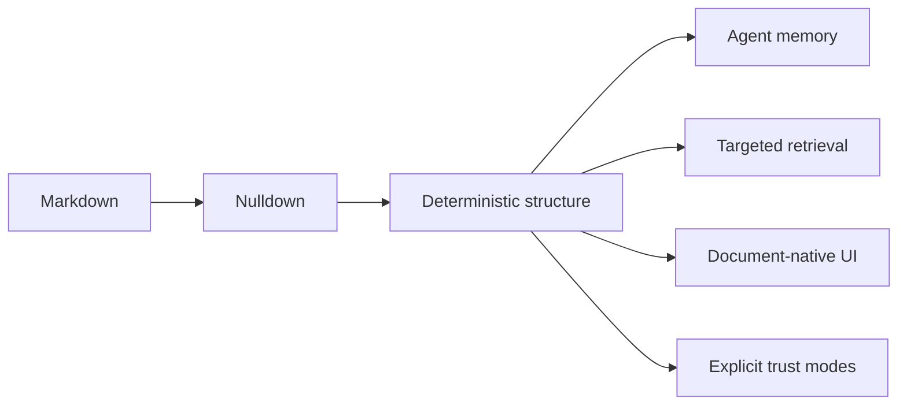

# Nulldown

**Nulldown turns Markdown into deterministic structure.**

Markdown is the shared language of people and agents. Nulldown makes it addressable, replayable, queryable, attributable, composable, and renderable, so one source can power documents, shared state, agent memory, targeted retrieval, workflows, and interfaces.


```mermaid
flowchart LR
  Markdown["Markdown"] --> Nulldown["Nulldown"]
  Nulldown --> State["Deterministic structure"]
  State --> Memory["Agent memory"]
  State --> Retrieval["Targeted retrieval"]
  State --> UI["Document-native UI"]
  State --> Trust["Explicit trust modes"]
```

Most systems repeatedly translate the same work between documents, prompts, databases, memory, and component state. Nulldown keeps those uses connected to readable Markdown and inspectable state.

## Start In A Minute

Install the Bun-native CLI. [Install Bun](https://bun.sh) first if it is not already on your `PATH`.

```bash
bun install -g @thenullnode/nulldown
nd --version
printf '%s\n' '# Hello from Nulldown' '' 'This is a disposable sample.' | nd create - --json
nd get <id-from-create> --raw
```

`nd create --json` returns the canonical `id` and a `url`. Use the `id` in later CLI commands and open the `url` to view the drop. This sends plaintext to `https://nulldown.app`; anyone with the returned URL can access it, so use only non-sensitive sample content.

Choose the surface that fits your work:

| Need | Start with |
| --- | --- |
| Read and author documents | [nulldown.app](https://nulldown.app) |
| Automate documents and branches | [CLI and API guide](docs/NULDOWN_API.md) |
| Connect an agent | [MCP server](packages/nulldown-mcp/README.md) |
| Run a local API | [Self-hosting](#self-host) |
| Understand the model | [Nulldown documentation](https://nulldown.app/d/vjdL1x) |

## What Exists Today

| Area                 | Current capability                                                                                                                                      |
| -------------------- | ------------------------------------------------------------------------------------------------------------------------------------------------------- |
| Deterministic state  | Ordered branch diff events, parent-linked snapshots, checkpoints, replay, and promotion.                                                                |
| Retrieval and memory | Structural document/runtime queries, source references, priority overlays, and optional NullMem facts, procedures, capabilities, and freshness signals. |
| Interfaces           | Native Nulldown composition, nullplug runtime contracts, runtime facts, and policy-controlled proposed mutations.                                       |
| Trust                | Public plaintext, client-sealed, provider-assisted, and self-hosted workflows with different explicit trust properties.                                 |
| Account continuity   | OpenAuth can bind a current V1 account and store a browser-encrypted key package for recovery of known private links on another signed-in browser.       |
| Deployment           | Cloudflare Pages/R2/D1 plus a self-hostable Bun API backend using filesystem blobs and SQLite metadata.                                                 |

## Authenticated Branch Workflow

Creating and reading plaintext drops does not require an account session. Resolving branches, promoting changes, and protected diff writes do. Set `ND_TOKEN` to an account session token before using those operations. `ND_ACCOUNT_ID` is only for local development against a server that explicitly enables its insecure account header.

```bash
export ND_TOKEN='<account-session-token>'
nd branch resolve <rootId> --json
nd branch content <rootId> <branchId> --json
nd branch query <rootId> <branchId> --query "important section" --top 3 --json
```

Authorize the CLI through the signed-in browser by opening the printed
verification URL and entering the printed authorization code. The refreshable
credential is kept in the default private config directory:

```bash
nd auth login
nd auth status
nd auth logout
```

An authoring-capable login seals authenticated `create` and `update` content in
the CLI before it is sent to the API. Use `--visibility private|unlisted|public`
to select sharing behavior; it defaults to `unlisted`. Private drops are
vault-only, while unlisted and public drops use provider escrow for recovery.
The CLI reads the public `VITE_PROVIDER_ENCRYPTION_PUBLIC_JWK` setting for that
escrow path and never needs a provider private key. Older credentials must run
`nd auth login` again before account-owned authoring. Use `--legacy-plaintext`
only for intentional compatibility: it stores plaintext and does not enter
Remote Library.

MCP integrations can seal account-owned drops through the stable root export:

```ts
import {
  sealDropForAuthoring,
  type DropAccountEncryptionMaterial,
  type DropDelegateSigningMaterial,
  type DropProviderEncryptionMaterial,
  type SealDropForAuthoringInput,
} from "@thenullnode/nulldown/drop/authoring";
```

Use `--no-browser` to print the verification URL and authorization code
without opening it. Set
`ND_AUTH_FILE` or pass `--auth-file` to select another credential file. Direct
`--token` and `ND_TOKEN` values still take precedence over the stored CLI
credential.

When retrying `nd diff apply` after an ambiguous network failure, reuse both the
original event identity and creation time. A successful response includes the
durable event receipt; do not retry with a new identity until the original outcome
is known. For a generated `diff replace`, save the generated envelope and retry it
with `diff event` or `diff batch`; replacement re-computes its operations from live
branch content and is not an exact replay surface.

```bash
nd diff apply <rootId> --branch <branchId> --event-id retry-1 --created-at 1770000000000 --insert '0:retry' --json
```

Run against a local or preview API:

```bash
nd --base=http://127.0.0.1:8788 get <id> --json
```

## Agents And MCP

This checkout prepares the unpublished `0.0.8` core and MCP pair. MCP requires
core `>=0.0.8 <0.1.0` for the strategy-read contract below. Registry install
commands do not install this local candidate; verification uses both local tarballs.

Use the separate MCP package to let agents retrieve structure, manage branch diffs, and work with NullMem without shelling out:

```bash
bun install -g @thenullnode/nulldown-mcp
```

`nulldown-mcp` is a stdio server configured by an MCP client, not an interactive terminal program. Configure `ND_BASE_URL` for a non-production target and `ND_TOKEN` for authenticated operations. Read/query tools support bounded compact responses; expand exact branch content only when a decision needs it. See the [MCP package README](packages/nulldown-mcp/README.md).

## Documentation

The canonical conceptual documentation lives in Nulldown:

- [Documentation index](https://nulldown.app/d/vjdL1x)
- [Why Nulldown: deterministic structure for Markdown](https://nulldown.app/d/q2BylK)
- [State model](https://nulldown.app/d/H305WE)
- [Agents, retrieval, and memory](https://nulldown.app/d/TwPp4l)
- [Documents as interfaces](https://nulldown.app/d/SqO1St)
- [Privacy and trust boundaries](https://nulldown.app/d/9a7WcT)
- [Build with Nulldown](https://nulldown.app/d/hCPw9B)
- [Status and direction](https://nulldown.app/d/OXIC7z)

The local [`docs/`](docs/README.md) directory contains source-coupled API and operational references.

## Nullplug Providers

`VoidProvider.nullplug` is the common invocation boundary for trusted built-ins and registered remote HTTP nullplugs. The runtime resolves a plugin, normalizes its return into `NullplugInvokeResponse`, applies the configured policy validator, and preserves structured results for editor and public render surfaces.

Remote manifests declare the versioned invocation media type `application/vnd.nulldown.nullplug.invoke+json;version=1`. Provider invocation rechecks the endpoint allowlist, narrows capabilities to the manifest permissions, enforces a timeout and response-size limit, and rejects non-conforming responses. It never imports code from manifest URLs.

`strategy_get` (SDK: `client.readStrategy`) uses an explicit `branchId` without
reading the root. Otherwise it reads the root once and follows plaintext payload
metadata `strategyRef: { kind: "branch", rootDropId: "<canonical same root>", branchId: "<explicit branch>" }`.
Both ids must be nonempty trimmed strings. Short input ids are checked against the
canonical id returned by the root read. Explicit branch responses must match the requested canonical root or its
six-character short alias. Without a reference it stays a labeled root
read; `query`, `snapshotId` and `top` require an explicit or metadata-selected branch.
Reads never resolve/create branches, follow references recursively, or fall back
after invalid/cross-root references or branch errors. Routing is not authorization.
Envelope metadata is not followed and no secrets are decrypted. Existing drops are
not migrated: publishing a branch and revision-safely updating its original root's
metadata are separate explicit actions; preserve the root content and other metadata.
Output defaults to 800 approximate tokens (`maxTokens`, 100-8000), bounded to
`maxTokens * 4` serialized characters even with `format: "full"` or `preview: false`.
Root/branch/snapshot identity, partial/truncated flags and requery guidance survive
payload truncation. `getDrop` / `drop_get` remain the raw root read interfaces.

New committed branch snapshots carry an authoritative `sourceContentHash` in
snapshot JSON. Document queries can reuse a matching current-version projection
without replaying content. Missing or stale projections reconstruct and validate
the source before repair; inconsistent authoritative hashes fail explicitly.
Legacy snapshots and mutable snapshot zero still reconstruct on every query,
without writing hashes back. Runtime fact freshness and per-query priority reads
remain independent of document projection reuse. No database migration is required.

Resolved queries and updates check root plaintext-read permissions before using
cached or regenerated heaps. Private and account-vault-only envelopes require the
root owner's authenticated session. Runtime projections additionally require the
branch owner or writer; rebuild requests reject client-supplied runtime fact arrays
and use facts persisted through the state/submit endpoints.

## Interactive Approval

An authenticated remote branch can render a built-in approval nullplug in the editor:

````markdown
```approval(id="release-42")
Approve the production release?
```
````

The `id` is required and should remain stable. Submitting the form stores an immutable, actor-attributed `ui.response` fact and rebuilds the branch runtime-reference heap. Agents can retrieve the decision with MCP `branch_query` using resolver `nulldown.resolved.runtime-refs`, kind `ui.response`, and primitive id `release-42`. Approval responses never apply document diffs or mint runtime authority by themselves.

## Self-Host

Run the API locally with filesystem blob storage and SQLite metadata:

```bash
nd serve --host 127.0.0.1 --port 8788 --data-dir .nulldown-data
```

The local SQLite runner records successful migration files transactionally, so
restarts do not repeat account-schema alterations. Its startup `migrationsApplied`
list contains only files applied during that invocation.
For databases created before the migration ledger, existing DDL is adopted only
after matching its stored schema definition. Missing statements still execute;
incompatible definitions fail and roll back that migration rather than being marked applied.

Run the same API in Docker with `/data` as the persistent volume:

```bash
docker build -t nulldown .
docker run --rm -p 8788:8788 -v nulldown-data:/data nulldown
```

The local server supports core drop, branch, diff, resolved-query, priority, and NullMem routes. It is a self-hostable API backend, not a full packaged replacement for every hosted route or the web application.

## Development

Install dependencies:

```bash
bun install
```

The root-only `@thenullnode/nulldown: file:.` override links MCP to this checkout
while `0.0.8` is unpublished. It does not replace the MCP package's consumer
dependency range; installed-pair verification supplies both exact tarballs.

Run the Vite development server:

```bash
bun run dev
```

Run Cloudflare Pages development with Functions:

```bash
bun run pages:dev
```

Run focused verification:

```bash
bun run test
bun run build
bun run cli:build
bun run package:check-cli
bun run package:check-mcp
```

### Local MemoryAgentBench native gateway

Run `bun --no-env-file scripts/memory-agent-bench-mcp-bridge.ts` from the checkout.
The bridge accepts sequential JSON lines and emits one
`@@NULLDOWN_MEMORY_AGENT_BENCH@@`-prefixed JSON response per command. It creates
disposable local storage and starts the packaged MCP server through the SDK's
stdio transport in a clean environment.

Host lifecycle: `start`, `ingest` (`index`, `chunk`), `finalize`, then `list_tools`.
Before each question the host must send `{"op":"begin_question"}`. Expose only
the returned model tools: `branch_query` (`query`, `top`, 1–50) and `source_read`
(`capability`). Invoke them with `{"op":"call_tool","name":"branch_query",
"arguments":{"query":"search terms","top":3}}`. The host-only `retrieve`
operation (`query`, `topK`) is an alias for the same budgeted query.

Query `result.items` contain source references, a `previewOnly` preview, and an
opaque capability. Only `source_read` returns the exact original decoded `chunk`;
its capability is bound to that node, range, content hash, root, branch and final
snapshot. Route overrides and extra fields are rejected. Each question has six
total tool attempts, including invalid calls, and resetting the question expires
all earlier capabilities. Truncated MCP responses fail closed: narrow the query
or reduce `top`. The Python planner owns the final evidence limit of ten.

Host-only `trace` returns sanitized timings, budgets, source refs and errors.
Send `dispose` (also automatic on stdin EOF) to close the MCP child before local
SQLite/storage cleanup. Lifecycle and reset operations must never become model
tools. The original `memory-agent-bench-bridge.ts` remains the official-arm entry.

## Contributing

Repository rules live in [AGENTS.md](AGENTS.md). Nulldown-hosted plans, documentation, and agent memory are updated with branch diffs and verified through resolved queries. The local [`docs/`](docs/README.md) directory retains source-coupled references and migration material; the hosted documentation graph is the public conceptual source of truth.

## License

MIT
