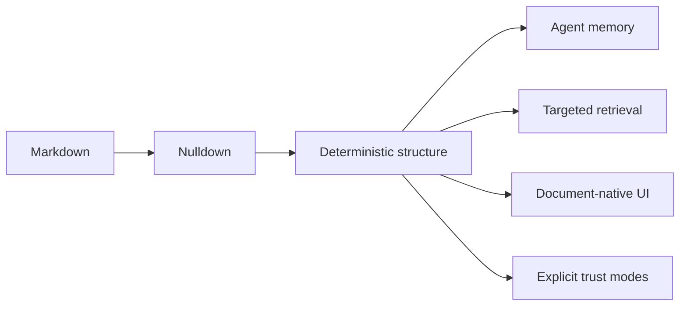

# Nulldown

**Nulldown turns Markdown into deterministic structure.**

Markdown is the shared language of people and agents. Nulldown makes it addressable, replayable, queryable, attributable, composable, and renderable, so one source can power documents, shared state, agent memory, targeted retrieval, workflows, and interfaces.


```mermaid
flowchart LR
  Markdown["Markdown"] --> Nulldown["Nulldown"]
  Nulldown --> State["Deterministic structure"]
  State --> Memory["Agent memory"]
  State --> Retrieval["Targeted retrieval"]
  State --> UI["Document-native UI"]
  State --> Trust["Explicit trust modes"]
```

Most systems repeatedly translate the same work between documents, prompts, databases, memory, and component state. Nulldown keeps those uses connected to readable Markdown and inspectable state.

## Start Here

The canonical documentation lives in Nulldown:

- [Documentation index](https://nulldown.app/d/vjdL1x)
- [Why Nulldown: deterministic structure for Markdown](https://nulldown.app/d/q2BylK)
- [State model](https://nulldown.app/d/H305WE)
- [Agents, retrieval, and memory](https://nulldown.app/d/TwPp4l)
- [Documents as interfaces](https://nulldown.app/d/SqO1St)
- [Privacy and trust boundaries](https://nulldown.app/d/9a7WcT)
- [Build with Nulldown](https://nulldown.app/d/hCPw9B)
- [Status and direction](https://nulldown.app/d/OXIC7z)

## What Exists Today

| Area                 | Current capability                                                                                                                                      |
| -------------------- | ------------------------------------------------------------------------------------------------------------------------------------------------------- |
| Deterministic state  | Ordered branch diff events, parent-linked snapshots, checkpoints, replay, and promotion.                                                                |
| Retrieval and memory | Structural document/runtime queries, source references, priority overlays, and optional NullMem facts, procedures, capabilities, and freshness signals. |
| Interfaces           | Native Nulldown composition, nullplug runtime contracts, runtime facts, and policy-controlled proposed mutations.                                       |
| Trust                | Public plaintext, client-sealed, provider-assisted, and self-hosted workflows with different explicit trust properties.                                 |
| Deployment           | Cloudflare Pages/R2/D1 plus a self-hostable Bun API backend using filesystem blobs and SQLite metadata.                                                 |

## Nullplug Providers

`VoidProvider.nullplug` is the common invocation boundary for trusted built-ins and registered remote HTTP nullplugs. The runtime resolves a plugin, normalizes its return into `NullplugInvokeResponse`, applies the configured policy validator, and preserves structured results for editor and public render surfaces.

Remote manifests declare the versioned invocation media type `application/vnd.nulldown.nullplug.invoke+json;version=1`. Provider invocation rechecks the endpoint allowlist, narrows capabilities to the manifest permissions, enforces a timeout and response-size limit, and rejects non-conforming responses. It never imports code from manifest URLs.

## Quick Start

Install the CLI:

```bash
bun install -g @thenullnode/nulldown
nd --help
```

Create a document, edit its branch, and retrieve the changed structure:

```bash
nd create README.md --json
nd branch resolve <rootId> --json
nd diff apply <rootId> --branch <branchId> --insert '0:# Updated title\n\n' --json
nd branch query <rootId> <branchId> --query "updated title" --top 1 --json
```

Run against a local or preview API:

```bash
nd --base=http://127.0.0.1:8788 get <id> --json
```

## Agents And MCP

This checkout prepares the unpublished `0.0.8` core and MCP pair. MCP requires
core `>=0.0.8 <0.1.0` for the strategy-read contract below. Registry install
commands do not install this local candidate; verification uses both local tarballs.

Use the separate MCP package to let agents retrieve structure, manage branch diffs, and work with NullMem without shelling out:

```bash
bun install -g @thenullnode/nulldown-mcp
nulldown-mcp
```

Configure `ND_BASE_URL`, `ND_TOKEN`, `ND_ACCOUNT_ID`, and `ND_CLIENT_ID` in the MCP client environment as needed. Read/query tools support bounded compact responses; expand exact branch content only when a decision needs it. See the [MCP package README](packages/nulldown-mcp/README.md).

`strategy_get` (SDK: `client.readStrategy`) uses an explicit `branchId` without
reading the root. Otherwise it reads the root once and follows plaintext payload
metadata `strategyRef: { kind: "branch", rootDropId: "<canonical same root>", branchId: "<explicit branch>" }`.
Both ids must be nonempty trimmed strings. Short input ids are checked against the
canonical id returned by the root read. Without a reference it stays a labeled root
read; `query`, `snapshotId` and `top` require an explicit or metadata-selected branch.
Reads never resolve/create branches, follow references recursively, or fall back
after invalid/cross-root references or branch errors. Routing is not authorization.
Envelope metadata is not followed and no secrets are decrypted. Existing drops are
not migrated: publishing a branch and revision-safely updating its original root's
metadata are separate explicit actions; preserve the root content and other metadata.
Output defaults to 800 approximate tokens (`maxTokens`, 100-8000), bounded to
`maxTokens * 4` serialized characters even with `format: "full"` or `preview: false`.
Root/branch/snapshot identity, partial/truncated flags and requery guidance survive
payload truncation. `getDrop` / `drop_get` remain the raw root read interfaces.

New committed branch snapshots carry an authoritative `sourceContentHash` in
snapshot JSON. Document queries can reuse a matching current-version projection
without replaying content. Missing or stale projections reconstruct and validate
the source before repair; inconsistent authoritative hashes fail explicitly.
Legacy snapshots and mutable snapshot zero still reconstruct on every query,
without writing hashes back. Runtime fact freshness and per-query priority reads
remain independent of document projection reuse. No database migration is required.

## Interactive Approval

An authenticated remote branch can render a built-in approval nullplug in the editor:

````markdown
```approval(id="release-42")
Approve the production release?
```
````

The `id` is required and should remain stable. Submitting the form stores an immutable, actor-attributed `ui.response` fact and rebuilds the branch runtime-reference heap. Agents can retrieve the decision with MCP `branch_query` using resolver `nulldown.resolved.runtime-refs`, kind `ui.response`, and primitive id `release-42`. Approval responses never apply document diffs or mint runtime authority by themselves.

## Self-Host

Run the API locally with filesystem blob storage and SQLite metadata:

```bash
nd serve --host 127.0.0.1 --port 8788 --data-dir .nulldown-data
```

Run the same API in Docker with `/data` as the persistent volume:

```bash
docker build -t nulldown .
docker run --rm -p 8788:8788 -v nulldown-data:/data nulldown
```

The local server supports core drop, branch, diff, resolved-query, priority, and NullMem routes. It is a self-hostable API backend, not a full packaged replacement for every hosted route or the web application.

## Development

Install dependencies:

```bash
bun install
```

The root-only `@thenullnode/nulldown: file:.` override links MCP to this checkout
while `0.0.8` is unpublished. It does not replace the MCP package's consumer
dependency range; installed-pair verification supplies both exact tarballs.

Run the Vite development server:

```bash
bun run dev
```

Run Cloudflare Pages development with Functions:

```bash
bun run pages:dev
```

Run focused verification:

```bash
bun run test
bun run build
bun run cli:build
bun run package:check-cli
bun run package:check-mcp
```

## Contributing

Repository rules live in [AGENTS.md](AGENTS.md). Nulldown-hosted plans, documentation, and agent memory are updated with branch diffs and verified through resolved queries. The local [`docs/`](docs/README.md) directory retains source-coupled references and migration material; the hosted documentation graph is the public conceptual source of truth.

## License

MIT
