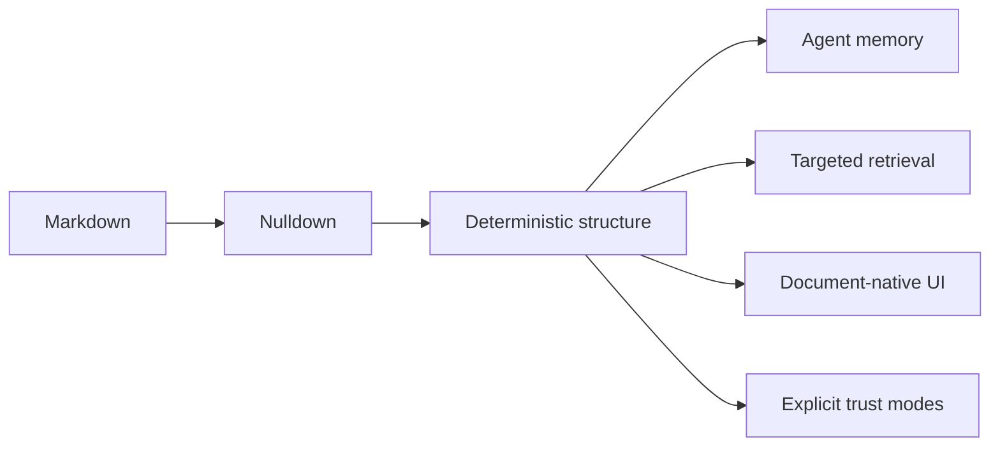

# Nulldown

**Nulldown turns Markdown into deterministic structure.**

Markdown is the shared language of people and agents. Nulldown makes it addressable, replayable, queryable, attributable, composable, and renderable, so one source can power documents, shared state, agent memory, targeted retrieval, workflows, and interfaces.


```mermaid
flowchart LR
  Markdown["Markdown"] --> Nulldown["Nulldown"]
  Nulldown --> State["Deterministic structure"]
  State --> Memory["Agent memory"]
  State --> Retrieval["Targeted retrieval"]
  State --> UI["Document-native UI"]
  State --> Trust["Explicit trust modes"]
```

Most systems repeatedly translate the same work between documents, prompts, databases, memory, and component state. Nulldown keeps those uses connected to readable Markdown and inspectable state.

## Start Here

The canonical documentation lives in Nulldown:

- [Documentation index](https://nulldown.app/d/vjdL1x)
- [Why Nulldown: deterministic structure for Markdown](https://nulldown.app/d/q2BylK)
- [State model](https://nulldown.app/d/H305WE)
- [Agents, retrieval, and memory](https://nulldown.app/d/TwPp4l)
- [Documents as interfaces](https://nulldown.app/d/SqO1St)
- [Privacy and trust boundaries](https://nulldown.app/d/9a7WcT)
- [Build with Nulldown](https://nulldown.app/d/hCPw9B)
- [Status and direction](https://nulldown.app/d/OXIC7z)

## What Exists Today

| Area                 | Current capability                                                                                                                                      |
| -------------------- | ------------------------------------------------------------------------------------------------------------------------------------------------------- |
| Deterministic state  | Ordered branch diff events, parent-linked snapshots, checkpoints, replay, and promotion.                                                                |
| Retrieval and memory | Structural document/runtime queries, source references, priority overlays, and optional NullMem facts, procedures, capabilities, and freshness signals. |
| Interfaces           | Native Nulldown composition, nullplug runtime contracts, runtime facts, and policy-controlled proposed mutations.                                       |
| Trust                | Public plaintext, client-sealed, provider-assisted, and self-hosted workflows with different explicit trust properties.                                 |
| Account continuity   | OpenAuth can bind a current V1 account and store a browser-encrypted key package for recovery of known private links on another signed-in browser.       |
| Deployment           | Cloudflare Pages/R2/D1 plus a self-hostable Bun API backend using filesystem blobs and SQLite metadata.                                                 |

## Nullplug Providers

`VoidProvider.nullplug` is the common invocation boundary for trusted built-ins and registered remote HTTP nullplugs. The runtime resolves a plugin, normalizes its return into `NullplugInvokeResponse`, applies the configured policy validator, and preserves structured results for editor and public render surfaces.

Remote manifests declare the versioned invocation media type `application/vnd.nulldown.nullplug.invoke+json;version=1`. Provider invocation rechecks the endpoint allowlist, narrows capabilities to the manifest permissions, enforces a timeout and response-size limit, and rejects non-conforming responses. It never imports code from manifest URLs.

## Quick Start

Install the CLI:

```bash
bun install -g @thenullnode/nulldown
nd --help
```

Create a document, edit its branch, and retrieve the changed structure:

```bash
nd create README.md --json
nd branch resolve <rootId> --json
nd diff apply <rootId> --branch <branchId> --insert '0:# Updated title\n\n' --json
nd branch query <rootId> <branchId> --query "updated title" --top 1 --json
```

Authorize the CLI through the signed-in browser by opening the printed
verification URL and entering the printed authorization code. The refreshable
credential is kept in the default private config directory:

```bash
nd auth login
nd auth status
nd auth logout
```

Use `--no-browser` to print the verification URL and authorization code
without opening it. Set
`ND_AUTH_FILE` or pass `--auth-file` to select another credential file. Direct
`--token` and `ND_TOKEN` values still take precedence over the stored CLI
credential.

When retrying `nd diff apply` after an ambiguous network failure, reuse both the
original event identity and creation time. A successful response includes the
durable event receipt; do not retry with a new identity until the original outcome
is known. For a generated `diff replace`, save the generated envelope and retry it
with `diff event` or `diff batch`; replacement re-computes its operations from live
branch content and is not an exact replay surface.

```bash
nd diff apply <rootId> --branch <branchId> --event-id retry-1 --created-at 1770000000000 --insert '0:retry\n' --json
```

Run against a local or preview API:

```bash
nd --base=http://127.0.0.1:8788 get <id> --json
```

## Agents And MCP

Use the separate MCP package to let agents retrieve structure, manage branch diffs, and work with NullMem without shelling out:

```bash
bun install -g @thenullnode/nulldown-mcp
nulldown-mcp
```

Configure `ND_BASE_URL`, `ND_TOKEN`, `ND_ACCOUNT_ID`, and `ND_CLIENT_ID` in the MCP client environment as needed. Read/query tools support bounded compact responses; expand exact branch content only when a decision needs it. See the [MCP package README](packages/nulldown-mcp/README.md).

## Interactive Approval

An authenticated remote branch can render a built-in approval nullplug in the editor:

````markdown
```approval(id="release-42")
Approve the production release?
```
````

The `id` is required and should remain stable. Submitting the form stores an immutable, actor-attributed `ui.response` fact and rebuilds the branch runtime-reference heap. Agents can retrieve the decision with MCP `branch_query` using resolver `nulldown.resolved.runtime-refs`, kind `ui.response`, and primitive id `release-42`. Approval responses never apply document diffs or mint runtime authority by themselves.

## Self-Host

Run the API locally with filesystem blob storage and SQLite metadata:

```bash
nd serve --host 127.0.0.1 --port 8788 --data-dir .nulldown-data
```

Run the same API in Docker with `/data` as the persistent volume:

```bash
docker build -t nulldown .
docker run --rm -p 8788:8788 -v nulldown-data:/data nulldown
```

The local server supports core drop, branch, diff, resolved-query, priority, and NullMem routes. It is a self-hostable API backend, not a full packaged replacement for every hosted route or the web application.

## Development

Install dependencies:

```bash
bun install
```

Run the Vite development server:

```bash
bun run dev
```

Run Cloudflare Pages development with Functions:

```bash
bun run pages:dev
```

Run focused verification:

```bash
bun run test
bun run build
bun run cli:build
bun run package:check-cli
bun run package:check-mcp
```

## Contributing

Repository rules live in [AGENTS.md](AGENTS.md). Nulldown-hosted plans, documentation, and agent memory are updated with branch diffs and verified through resolved queries. The local [`docs/`](docs/README.md) directory retains source-coupled references and migration material; the hosted documentation graph is the public conceptual source of truth.

## License

MIT
