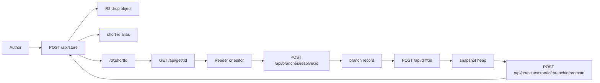

# Nulldown API Reference

This document is the CLI and API guide for Nulldown drops, branch editing, diffs, provider escrow unlock, and operational backfills.

Published Nulldown docs:

- [Docs index](https://nulldown.app/d/r1Belg)
- [API reference](https://nulldown.app/d/q7RRSk)
- [Agent skill prompt](https://nulldown.app/d/6p6ytx)

## Base URL

Production:

```text
https://nulldown.app
```

Local Pages Functions normally run behind Wrangler or a deployed Pages URL. The Vite dev server mocks local UI behavior and does not expose the production API surface.

## CLI Quickstart

The repo ships a Bun-native `nd`/`nulldown` CLI in `bin/nulldown.ts`. Use it for normal agent and operator workflows; use raw HTTP only when building another client or debugging the wire contract.

Run from the repo:

```bash
bun run nd -- --help
bun run nd -- doctor --json
```

Install globally from a checkout or published package:

```bash
bun install -g .
nd --help
```

The CLI stores user state in `~/.config/nulldown` by default so a global install does not depend on the current working directory.

Build a single-file executable:

```bash
bun run cli:build
./dist/nulldown --help
```

Common commands:

```bash
bun run nd -- create docs/NULDOWN_API.md --json
bun run nd -- get <id> --json
bun run nd -- get <id> --raw
bun run nd -- update <id> docs/NULDOWN_API.md --json
bun run nd -- delete <id> --json
bun run nd -- branch resolve <id> --json
bun run nd -- branch content <rootId> <branchId> --json
bun run nd -- diff replace <rootId> --branch <branchId> --to-file edited.md --json
bun run nd -- branch promote <rootId> <branchId> --json
```

Useful global flags and environment variables:

| CLI | Env | Notes |
| --- | --- | --- |
| `--base <url>` | `ND_BASE_URL` | Defaults to `https://nulldown.app`. |
| `--token <token>` | `ND_TOKEN` | Account bearer token. |
| `--account <id>` | `ND_ACCOUNT_ID` | Development account header. |
| `--client <id>` | `ND_CLIENT_ID` | Stable branch/diff client ID. |
| `--config-dir <dir>` | `ND_CONFIG_DIR` | Defaults to `~/.config/nulldown`. |
| `--diff-auth-token <token>` | `ND_DIFF_AUTH_TOKEN` | Inline `ndauth.v1` base64url diff auth bundle. |
| `--diff-auth-token-file <file>` | `ND_DIFF_AUTH_TOKEN_FILE` | Defaults to `~/.config/nulldown/diff-auth.token`. |
| `--json` | none | Stable machine-readable output. |

## Mental Model

Nulldown has two related write paths:

| Path | Use | Mutability | Notes |
| --- | --- | --- | --- |
| Drop object | Shared document body or encrypted envelope | Replace/upsert | Stored in R2 under a canonical 12-character ID. |
| Branch diff stream | Editable branch rooted at a drop | Append-only events | Used for atomic edits, snapshots, and promotion. |

Short links use the first 6 characters of the canonical ID. APIs accept either short or full IDs, but responses expose the canonical ID where relevant.

## Lifecycle Diagram



## IDs And Revisions

| Concept | Shape | Source |
| --- | --- | --- |
| Canonical drop ID | 12 characters | `id` in `/api/store` response or `X-Drop-Canonical-Id`. |
| Short drop ID | first 6 characters | Used in `/d/:id` links. |
| Revision | R2 ETag string | `ETag` and `X-Drop-Revision` from `GET /api/get/:id`. |

Use exact revision strings, including quotes if the header includes them.

## State And Metadata

Drop state belongs in `payload.metadata`, not in markdown content. Markdown should render UI; metadata should drive readers, agents, and diff replay.

Good metadata fields:

```json
{
  "themeId": "system",
  "allowedUrls": ["nulldown.app", "www.youtube.com"],
  "baseDropId": "root-or-parent-id",
  "rootDropId": "root-id",
  "branchId": "branch-id",
  "snapshotId": 3,
  "uiState": {
    "docType": "nulldown.ui.state.v1",
    "revision": 1,
    "activePanel": "overview"
  }
}
```

Agents and CLIs should read metadata before content when they need state.

## Authentication

| Mechanism | Headers | Used By |
| --- | --- | --- |
| Account session token | `Authorization: Bearer <token>` | Branch resolve, promote, authenticated account flows. |
| Insecure account header | `x-nulldown-account-id: <id>` | Development only when `ALLOW_INSECURE_ACCOUNT_HEADER=1` or no `ACCOUNT_AUTH_SECRET`. |
| Diff credential HMAC | `x-nulldown-client-id`, `x-nulldown-secret-kid`, `x-nulldown-timestamp`, `x-nulldown-signature` | Provider-authorized diff writes. |
| Admin bearer token | `Authorization: Bearer <token>` | Backfill endpoints. |

Never log tokens, private keys, wrapped keys, or decrypted plaintext.

## Error Format

Newer endpoints return structured JSON errors:

```json
{
  "error": "Drop revision precondition failed. Refresh and try again.",
  "code": "revision_precondition_failed",
  "details": {}
}
```

Some older endpoints still return plain text errors. Robust clients should handle both.

Common codes:

| Code | Meaning | Recovery |
| --- | --- | --- |
| `invalid_json` | Request body was not parseable JSON. | Fix payload. |
| `unsupported_payload` | JSON did not match `DropPayload` or `DropEnvelopeV1`. | Send `{ content, metadata? }` or `{ envelope }`. |
| `alias_conflict` | Requested ID short alias is already owned by another full ID. | Use a different ID. |
| `object_conflict` | Drop ID already exists and `upsert` was false. | Use `upsert` or new ID. |
| `revision_precondition_failed` | `expectedRevision` or `If-Match` did not match. | Re-fetch and retry deliberately. |
| `validation_failed` | Zod validation failed. | Inspect `details`. |
| `body_too_large` | Diff body exceeds limit. | Split event batches. |

## Drop Payloads

Plaintext JSON payload:

```json
{
  "content": "# Hello\n",
  "metadata": {
    "themeId": "system",
    "allowedUrls": ["nulldown.app"]
  }
}
```

Encrypted envelope payloads use the `nmdn.drop.v1` schema and are usually produced by the browser. Plain API clients should not forge encrypted envelopes unless they can sign and wrap keys correctly.

Relevant shared contracts live in:

```text
shared/drop/types.ts
shared/drop/diff.ts
shared/drop/branch.ts
shared/drop/diffAuth.ts
shared/nullplug/types.ts
shared/nullplug/ui.ts
```

## Native Nulldown Cards

Use the built-in `nd` nullplug to compose Nulldown drops without iframe embedding. It renders a compact card by default with title, preview, link, and metadata hints.

Fence-argument syntax:

````markdown
```nd(id="H2oXJR")
```
````

Body syntax:

````markdown
```nd
H2oXJR
```
````

The renderer resolves through the active drop provider when available. Use `embed` only for external sites that require iframe rendering and keep those hosts in `metadata.allowedUrls`.

## Endpoint Reference

### POST /api/store

Create or upsert a drop.

Request content types:

| Content-Type | Body |
| --- | --- |
| `text/plain` | Raw markdown text. |
| `application/json` | `DropPayload`, `DropEnvelopeV1`, or wrapper object. |

JSON wrapper shape:

```json
{
  "id": "optional-canonical-id",
  "upsert": true,
  "expectedRevision": "\"etag-from-get\"",
  "content": "# Markdown",
  "metadata": {}
}
```

Envelope wrapper shape:

```json
{
  "id": "optional-canonical-id",
  "upsert": true,
  "expectedRevision": "\"etag-from-get\"",
  "envelope": {
    "schema": "nmdn.drop.v1",
    "version": 1
  }
}
```

Response:

```json
{
  "id": "tMSfKJ7X93C0",
  "url": "https://nulldown.app/d/tMSfKJ"
}
```

CLI create:

```bash
bun run nd -- create README.md --json
```

HTTP fallback:

```bash
curl -sS https://nulldown.app/api/store \
  -H 'Content-Type: application/json' \
  --data '{"content":"# Hello\n","metadata":{"themeId":"system"}}'
```

CLI revision-safe upsert:

```bash
bun run nd -- update tMSfKJ7X93C0 README.md --json
```

HTTP fallback:

```bash
curl -sS https://nulldown.app/api/store \
  -H 'Content-Type: application/json' \
  --data '{"id":"tMSfKJ7X93C0","upsert":true,"expectedRevision":"\"etag\"","content":"# Updated\n","metadata":{"themeId":"system"}}'
```

Implementation: `functions/api/store.ts`.

### GET /api/get/:id

Fetch a drop object by short or canonical ID.

Response headers:

| Header | Meaning |
| --- | --- |
| `Content-Type` | Stored content type. |
| `ETag` | Revision token. |
| `X-Drop-Revision` | Same revision token for app clients. |
| `X-Drop-Canonical-Id` | Resolved canonical ID. |

Response body is either raw text, a plaintext `DropPayload`, or encrypted `DropEnvelopeV1`.

CLI example:

```bash
bun run nd -- get tMSfKJ --json
bun run nd -- get tMSfKJ --raw
```

HTTP fallback:

```bash
curl -i https://nulldown.app/api/get/tMSfKJ
```

Implementation: `functions/api/get/[id].ts`.

### DELETE /api/delete/:id

Delete a drop, its short alias, and any public index entry.

Optional header:

```text
If-Match: "etag-from-get"
```

Response: `204 No Content`.

CLI example:

```bash
bun run nd -- delete tMSfKJ --json
```

HTTP fallback:

```bash
curl -X DELETE https://nulldown.app/api/delete/tMSfKJ \
  -H 'If-Match: "etag"'
```

Implementation: `functions/api/delete/[id].ts`.

### GET /api/list

List public drops from the public drop index.

Query parameters:

| Name | Default | Notes |
| --- | --- | --- |
| `limit` | `200` | Clamped to `1..1000`. |
| `cursor` | none | R2 pagination cursor. |

Response:

```json
{
  "items": [
    { "id": "drop-id", "createdAt": 1770000000000, "updatedAt": 1770000000000 }
  ],
  "cursor": null
}
```

Only encrypted envelopes with `visibility: "public"` are indexed by the normal store path.

Implementation: `functions/api/list.ts` and `functions/api/_lib/dropIndex.ts`.

### GET /api/search

Search the D1 search index.

Query parameters:

| Name | Default | Notes |
| --- | --- | --- |
| `q` | empty | Empty query lists records. |
| `owner` | none | Filters `ownerAccountId`. |
| `visibility` | none | Comma-separated visibilities. |
| `limit` | `20` | Clamped to `1..100`. |
| `offset` | `0` | Clamped to `>= 0`. |

Response:

```json
{
  "records": [
    {
      "id": "search-row-id",
      "dropId": "drop-id",
      "title": "Title",
      "contentPreview": "Preview",
      "contentHash": "hash",
      "ownerAccountId": null,
      "visibility": "public",
      "createdAt": 1770000000000,
      "updatedAt": 1770000000000,
      "metadata": {}
    }
  ],
  "total": 1,
  "query": "hello",
  "limit": 20,
  "offset": 0
}
```

Implementation: `functions/api/search.ts`, `src/lib/db/searchDatabase.ts`.

### POST /api/auth/session

Issue an account session token from an account proof.

Request:

```json
{
  "accountId": "acct-or-uuid",
  "signingPublicJwk": {},
  "signedAt": 1770000000000,
  "signature": "base64url-signature"
}
```

The signed message is:

```text
nulldown-account-auth
<accountId>
<signedAt>
```

Response:

```json
{
  "token": "ndacc.v1....",
  "expiresAt": 1770003600000,
  "accountId": "acct-or-uuid"
}
```

Implementation: `functions/api/auth/session.ts`, `functions/api/_lib/accountAuth.ts`.

### POST /api/unlock/:id

Provider escrow unlock. The server decrypts the provider-wrapped content key and re-wraps it to the requester public key. It does not return plaintext content.

Request:

```json
{
  "requesterPublicJwk": {}
}
```

Response:

```json
{
  "wrappedKey": "base64-rsa-oaep-wrapped-content-key"
}
```

Requirements:

| Requirement | Notes |
| --- | --- |
| `PROVIDER_ENCRYPTION_PRIVATE_JWK` | Must be configured. |
| Drop must be `DropEnvelopeV1` | Plain payloads cannot be unlocked. |
| `unlockPolicy: "provider-escrow"` | Vault-only drops reject this path. |

Implementation: `functions/api/unlock/[id].ts`.

### POST /api/diff-auth/register/:id

Register provider-issued diff credentials for a client. Requires an authenticated account session.

CLI flow:

```bash
bun run nd -- diff keygen --client <clientId>
bun run nd -- diff register <dropId> --token <account-session-token> --json
bun run nd -- diff token export
```

`diff keygen` and `diff register` write a single base64url token file at `~/.config/nulldown/diff-auth.token` by default. The token has the form `ndauth.v1.<payload>` and can include the RSA private key plus unwrapped HMAC credentials, so treat it as sensitive.

Move credentials to another machine or global install:

```bash
TOKEN=$(bun run nd -- diff token export)
bun run nd -- diff token import "$TOKEN" --force
```

Request:

```json
{
  "requesterPublicJwk": {},
  "clientId": "optional-client-id"
}
```

Response:

```json
{
  "dropId": "canonical-drop-id",
  "branchId": "owner-or-clone-branch",
  "clientId": "client-id",
  "kid": "credential-id",
  "wrappedSecret": "base64-rsa-oaep-secret",
  "expiresAt": 1770000000000
}
```

Implementation: `functions/api/diff-auth/register/[id].ts`.

### GET /api/diff/:id

Poll branch diff events.

CLI examples:

```bash
bun run nd -- diff latest <dropId> --branch <branchId> --json
bun run nd -- diff poll <dropId> --branch <branchId> --cursor -1 --json
```

Query parameters:

| Name | Required | Notes |
| --- | --- | --- |
| `cursor` | no | `__latest__`, integer string, or omitted. |
| `excludeClient` | no | Client ID to filter out. |
| `limit` | no | Default `50`, max `200`. |
| `branchId` | no | Explicit branch ID. |

Response:

```json
{
  "events": [],
  "cursor": null
}
```

`cursor=__latest__` returns no events and sets the cursor to the current branch head.

Implementation: `functions/api/diff/[id].ts`.

### POST /api/diff/:id

Append diff events to the resolved branch. Diff events are the normal edit
primitive: accepted writes advance the branch snapshot, and branch query lazily
materializes resolved heaps from that snapshot when needed.

CLI examples:

```bash
bun run nd -- diff apply <dropId> --branch <branchId> --insert 0:Hello --json
bun run nd -- diff replace <dropId> --branch <branchId> --to-file edited.md --json
bun run nd -- diff apply <dropId> --branch <branchId> --metadata-file event-meta.json --insert 0:Hello --json
bun run nd -- diff batch <dropId> --branch <branchId> --body-file batch.json --json
bun run nd -- diff event <dropId> --branch <branchId> --body-file event.json --json
```

Request body:

```json
{
  "version": 1,
  "events": [
    {
      "eventId": "client-unique-id",
      "seq": 0,
      "dropId": "canonical-drop-id",
      "sourceClientId": "client-id",
      "createdAt": 1770000000000,
      "metadata": {
        "kind": "nullplug.invoke",
        "intent": "embed child plan",
        "pluginId": "nd",
        "args": { "id": "childDropId", "mode": "card" },
        "labels": ["plan"],
        "confidence": 0.9
      },
      "ops": [
        { "type": "insert", "start": 0, "end": 0, "text": "Hello" }
      ]
    }
  ]
}
```

Response:

```json
{
  "accepted": 1,
  "branchId": "clone_anonymous",
  "snapshotId": 1,
  "totalStored": 1
}
```

`nd diff replace` can bootstrap a fresh branch by diffing from the root drop
content when the requested branch does not exist yet. `nd diff batch` posts the
same `DropDiffEnvelope` shape as `nd diff event`, but requires an explicit
`--branch` because it is intended for ordered branch mutations.

Limits:

| Limit | Value |
| --- | --- |
| Request body | 2,000,000 bytes |
| Events per envelope | 100 |
| Ops per event | 1000 |
| Legacy op text length | 1,000,000 chars |
| Native op data length | 1,500,000 chars |

Auth modes:

| Mode | Requirement |
| --- | --- |
| Provider credential | Diff auth headers. |
| Env webhook | `DIFF_WEBHOOK_SECRET` and valid signature. |
| None | Only when no webhook secret is configured. |

Diff signing payload:

```text
<METHOD>
<PATH>
<TIMESTAMP>
<RAW_BODY>
```

Signature header value is `sha256=<hex-hmac>`. Timestamp skew defaults to 5 minutes.

Implementation: `functions/api/diff/[id].ts`, `shared/drop/diffAuth.ts`.

### GET /api/branches/:id

List branches for a root drop.

Response:

```json
{
  "rootDropId": "canonical-root-id",
  "branches": []
}
```

Implementation: `functions/api/branches/[id].ts`.

### POST /api/branches/resolve/:id

Resolve or create a branch for the authenticated actor.

CLI example:

```bash
bun run nd -- branch resolve <id> --json
```

Headers:

| Header | Notes |
| --- | --- |
| `Authorization: Bearer <token>` | Preferred account auth. |
| `x-nulldown-account-id` | Development fallback only. |
| `x-nulldown-client-id` | Optional stable client ID. |

Response:

```json
{
  "rootDropId": "canonical-root-id",
  "branchId": "owner",
  "mode": "owner",
  "created": false,
  "headSnapshotId": 0,
  "ownerAccountId": "account-id",
  "writerAccountId": "account-id"
}
```

Implementation: `functions/api/branches/resolve/[id].ts`.

### GET /api/branches/:rootId/:branchId/content

Read materialized branch content at the branch head.

CLI example:

```bash
bun run nd -- branch content <rootId> <branchId> --json
```

Response:

```json
{
  "rootDropId": "canonical-root-id",
  "branchId": "branch-id",
  "snapshotId": 3,
  "content": "# Current branch content\n"
}
```

Implementation: `functions/api/branches/[rootId]/[branchId]/content.ts`.

### GET /api/branches/:rootId/:branchId/snapshots

List stored snapshots for a branch.

CLI example:

```bash
bun run nd -- branch snapshots <rootId> <branchId> --json
```

Response:

```json
{
  "rootDropId": "canonical-root-id",
  "branchId": "branch-id",
  "snapshots": [
    {
      "version": 1,
      "snapshotId": 0,
      "rootDropId": "canonical-root-id",
      "branchId": "branch-id",
      "parentSnapshotId": null,
      "seq": 0,
      "eventIds": [],
      "checkpointed": true,
      "textLength": 12,
      "createdAt": 1770000000000
    }
  ]
}
```

Implementation: `functions/api/branches/[rootId]/[branchId]/snapshots.ts`.

### GET /api/branches/:rootId/:branchId/resolved/query

Query top resolved heap nodes for a branch snapshot. The default document resolver indexes titles, headings, sections, paragraphs, list/checklist items, code blocks, nullplug refs, and links. `resolverId=nulldown.resolved.runtime-refs` queries runtime nodes for `nullplug.ref`, `ui.primitive`, `ui.response`, and `ui.state`. If a supported heap is missing or stale, the endpoint rebuilds it from authoritative branch content and stored nullplug UI facts.

Query params:

| Param | Default | Notes |
| --- | --- | --- |
| `snapshotId` | `latest` | Use `latest` or a numeric snapshot id. |
| `resolverId` | `nulldown.resolved.document` | Use `nulldown.resolved.runtime-refs` for runtime/UI fact nodes. |
| `q` / `query` | none | Lexical query text. |
| `k` / `top` | `10` | Max top nodes, capped server-side. |
| `kind` | all | Comma-separated document kinds such as `section,heading,nullplug.ref` or runtime kinds such as `ui.primitive,ui.response,ui.state`. |
| `fromSeq` / `toSeq` | none | Diff event sequence range used for changed-range boosts and event refs. |
| `changedOnly` | false | Return only nodes overlapping changed ranges. |
| `includeAncestors` | false | Include heading/section ancestors for context. |
| `includeEventMetadata` | true | Set `false` to strip event metadata refs. |
| `pluginId` / `callId` / `primitiveId` | none | Runtime resolver filters. |

CLI example:

```bash
bun run nd -- branch query <rootId> <branchId> --query "policy mutation" --top 10 --from-seq 18 --to-seq 20 --include-ancestors --json
bun run nd -- branch query <rootId> <branchId> --resolver nulldown.resolved.runtime-refs --query approve --kind ui.response,ui.state --json
```

Response excerpt:

```json
{
  "rootDropId": "canonical-root-id",
  "branchId": "branch-id",
  "snapshotId": 3,
  "resolverId": "nulldown.resolved.document",
  "sourceContentHash": "sha256:...",
  "stale": false,
  "heapGenerated": true,
  "nodes": [
    {
      "node": {
        "kind": "section",
        "text": "## Policy\nPolicy mutation downgrade rules...",
        "headingPath": ["Runtime", "Policy"],
        "sourceRange": { "start": 42, "end": 220 }
      },
      "score": 12.5,
      "reasons": ["query-match", "changed-range-overlap"],
      "eventRefs": [
        {
          "seq": 20,
          "eventId": "evt...",
          "metadata": { "kind": "agent.edit", "intent": "Explain policy" }
        }
      ]
    }
  ]
}
```

Implementation: `functions/api/branches/[rootId]/[branchId]/resolved/query.ts`.

### POST /api/branches/:rootId/:branchId/resolved/priority

Create a branch-scoped priority overlay fact. Priority facts do not mutate branch
markdown or rewrite heap deltas; they are D1-backed overlays read by
`resolved/query`. Node and heap facts affect current query scoring. Diff facts
are persisted for future diff-target scoring and retrieval. Node facts should
include a resolver id when the node id is resolver-specific; the CLI defaults
node facts to the document resolver.

Request:

```json
{
  "targetKind": "node",
  "targetId": "paragraph:sha256:...:42:120",
  "resolverId": "nulldown.resolved.document",
  "priority": 3,
  "reason": "Important for the next agent",
  "labels": ["agent-memory", "next-step"],
  "metadata": { "source": "manual" }
}
```

`targetKind` can be `node`, `heap`, or `diff`. `node` and `diff` facts require
`targetId`; `heap` facts can omit it and the server will derive a branch/resolver
target id. The authenticated account must own or write the branch.

CLI example:

```bash
bun run nd -- --account <accountId> branch priority <rootId> <branchId> --node <nodeId> --priority 3 --reason "important for the next agent" --json
bun run nd -- --account <accountId> branch priority <rootId> <branchId> --heap --priority 1.5 --labels agent-memory,next-step --json
```

Response excerpt:

```json
{
  "rootDropId": "canonical-root-id",
  "branchId": "branch-id",
  "fact": {
    "version": 1,
    "factId": "priority:...",
    "targetKind": "node",
    "targetId": "paragraph:...",
    "priority": 3
  }
}
```

Implementation: `functions/api/branches/[rootId]/[branchId]/resolved/priority.ts`.

### POST /api/branches/:rootId/:branchId/resolved/update

Repair or eagerly materialize derived resolved heaps for a branch snapshot. This
writes materialized views only; branch content remains authoritative. Normal
agentic edits should not call this endpoint: write diffs first, then use branch
query, which lazily generates supported missing or stale heaps from the latest
snapshot.

Request:

```json
{
  "resolverId": "all",
  "snapshotId": "latest",
  "uiPrimitives": []
}
```

`resolverId` can be `all`, `nulldown.resolved.document`, or `nulldown.resolved.runtime-refs`. Runtime updates automatically include durable `ui.response`, `ui.state.patch`, and `ui.state.snapshot` facts already stored for the branch.

CLI example:

```bash
bun run nd -- branch heap-update <rootId> <branchId> --resolver all --json
```

Use this command for repair/admin workflows, not as the primary memory write
path.

Implementation: `functions/api/branches/[rootId]/[branchId]/resolved/update.ts`.

### POST /api/nullplug/state

Store immutable nullplug-owned UI state facts. This endpoint accepts `ui.state.patch` and `ui.state.snapshot` facts and stores them under the canonical root drop. These facts are consumed by the runtime resolved heap and do not directly mutate branch markdown.

Request example:

```json
{
  "version": 1,
  "kind": "ui.state.patch",
  "id": "patch-1",
  "callId": "call-1",
  "createdAt": 1770000000000,
  "source": {
    "rootDropId": "root-drop-id",
    "branchId": "branch-id",
    "snapshotId": 3,
    "callId": "call-1"
  },
  "patch": [
    { "op": "set", "path": ["expanded"], "value": true }
  ]
}
```

Implementation: `functions/api/nullplug/state.ts`.

### POST /api/branches/:rootId/:branchId/promote

Create a new drop from branch head content.

CLI example:

```bash
bun run nd -- branch promote <rootId> <branchId> --token <account-session-token> --json
```

Auth: account session required. The account must be the branch owner or writer.

Response:

```json
{
  "dropId": "new-drop-id",
  "url": "https://nulldown.app/d/newDro",
  "rootDropId": "root-drop-id",
  "branchId": "branch-id",
  "snapshotId": 3
}
```

If provider encryption and signing keys are configured, promotion produces a sealed provider escrow envelope. Otherwise it stores a plaintext `DropPayload`.

Implementation: `functions/api/branches/[rootId]/[branchId]/promote.ts`.

## Admin Endpoints

### POST /api/branches/backfill/:id

Backfill branch state to snapshot heap v2.

Auth: `Authorization: Bearer <BRANCH_HEAP_BACKFILL_TOKEN>`.

Query:

| Name | Default | Max |
| --- | --- | --- |
| `limit` | `100` | `1000` |
| `cursor` | none | R2 cursor |

Response includes stats and optional cursor.

Runbook: `docs/BRANCH_HEAP_BACKFILL.md`.

### POST /api/index/backfill

Backfill short aliases and public index entries.

Auth: `Authorization: Bearer <DROP_INDEX_BACKFILL_TOKEN>`.

Query:

| Name | Default | Max |
| --- | --- | --- |
| `limit` | `200` | `1000` |
| `cursor` | none | R2 cursor |

Response includes scan/index stats and optional cursor.

Implementation: `functions/api/index/backfill.ts`.

## Correct Client Workflows

### Create A Plaintext Drop

```bash
bun run nd -- create doc.md --json
```

### Fetch Then Safely Upsert

```bash
bun run nd -- get tMSfKJ --json
bun run nd -- update tMSfKJ7X93C0 doc.md --json
bun run nd -- get tMSfKJ7X93C0 --json
```

### Append An Atomic Branch Edit

```bash
bun run nd -- branch content <rootId> <branchId> --json
bun run nd -- diff replace <rootId> --branch <branchId> --to-file edited.md --json
bun run nd -- branch content <rootId> <branchId> --json
```

### Read Branch Head Content

```bash
bun run nd -- branch content <rootId> <branchId> --json
```

## Security Notes

- `/api/get/:id` returns stored objects; encrypted drops remain encrypted.
- Provider escrow unlock re-wraps a key and does not return plaintext.
- Branch content can contain plaintext if a branch was initialized from provider escrow or plaintext payloads.
- Do not use branch endpoints as an authorization boundary until the caller model is explicitly enforced for your use case.
- Use revision preconditions for root upserts and deletes.
- Use append-only diffs for atomic branch edits.

## CLI And Script Aliases

Use `bun run nd -- ...` directly, or use the package aliases maintained for existing workflows:

```text
bun run branch:resolve -- --drop <id> --json
bun run branch:content -- --drop <id> --branch <branchId> --json
bun run branch:promote -- --drop <id> --branch <branchId> --json
bun run branch:backfill -- --drop <rootDropId> --token <token> --json
bun run diff:keygen -- --client <clientId>
bun run diff:register -- --drop <id> --token <account-session-token> --json
bun run diff:sign -- --drop <id> --body-file event.json --json
bun run nd -- diff token export
bun run nd -- diff token import <ndauth.v1.token> --force
```

Relevant files:

```text
bin/nulldown.ts
src/cli/index.ts
```
