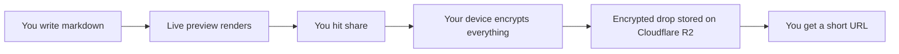
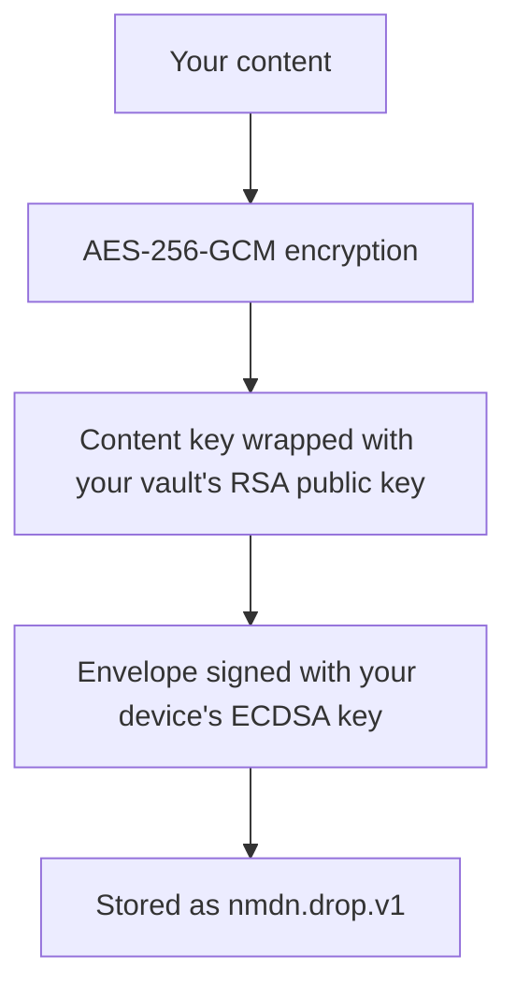
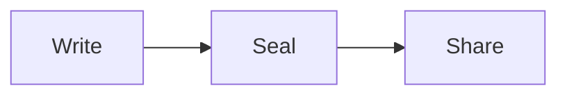

# **nulldown is nice**

---

> *Write markdown. Encrypt it client-side. Share a link. The server never sees your text.*

---

## What It Is

Nulldown is a minimalist markdown editor and encrypted sharing platform. You write in the browser, your device encrypts the document before it leaves, and anyone with the link (and the right key) can read it.

A shared document in nulldown is called a **drop**.

---

## The Problem

Sharing formatted text is either insecure or painful:

| What you want        | What you get today                    |
| -------------------- | ------------------------------------- |
| Write markdown       | Editor with no sharing                |
| Share a snippet      | Pastebin with no encryption           |
| Encrypt a doc        | GPG workflow disconnected from editor |
| Embed a video        | Copy-paste raw HTML                   |
| Track edit history   | Separate version control tool         |

Nulldown puts all of this in one place. One editor, one URL, one encrypted package.

---

## How It Works



The server stores ciphertext. It never sees your content. Decryption happens entirely in the browser using keys from your local passkey-protected vault.

---

## What You Can Write

Nulldown supports enhanced markdown out of the box:

- **Standard markdown** — headings, bold, italic, lists, links, images, blockquotes
- **GFM** — tables, strikethrough, task lists, autolinks
- **Code blocks** — syntax-highlighted in 100+ languages
- **LaTeX math** — inline `$E = mc^2$` and block `$$\int_0^x f(u)\,du$$`
- **Mermaid diagrams** — flowcharts, sequence diagrams, rendered as SVG
- **Embeds** — YouTube and Vimeo videos inline, sandboxed and validated

### Embeds

Drop a video URL into an embed block and it renders inline:

````markdown
```embed
https://www.youtube.com/watch?v=dQw4w9WgXcQ
```
````

Embeds are validated against a trusted host allowlist (YouTube, Vimeo). Untrusted URLs are blocked. Per-drop custom allowlists are supported.

---

## Encryption

Every drop is a sealed envelope. The crypto is real, not decorative.



- **AES-256-GCM** encrypts the content
- **RSA-OAEP** wraps the content key so only your vault can unwrap it
- **ECDSA P-256** signs the envelope so tampering is detectable
- **WebAuthn passkeys** gate access to your vault — no passwords

Your keys live in IndexedDB on your device. The server holds nothing but ciphertext and wrapped keys.

### Cross-Device Access

Need to open a drop on another device? Provider escrow mode wraps the content key a second time with a provider key. The server re-wraps it for your other device's vault — without ever seeing the content key in the clear.

---

## Visibility Controls

Every drop has a visibility level:

| Level      | Who can access                     |
| ---------- | ---------------------------------- |
| **Private**  | Only your vault on this device     |
| **Unlisted** | Anyone with the link and the key   |
| **Public**   | Anyone with the link               |

---

## Edit History

Nulldown tracks your edits as you type — not just the final result.

Every keystroke is recorded as a diff operation (insert or delete at a position). These diffs are grouped into **snapshots**. When you share a drop, the edit history can be bundled (encrypted) inside the envelope as a **draft pack**.

The recipient doesn't just get your document. They get how it was written.

---

## Drop Lineage

Clone a drop and its origin is preserved. Nulldown tracks a **lineage graph** — which drop was cloned from which, all the way back to the root. Document provenance, built in.

---

## Offline Mode

No connection? Drops are stored locally in IndexedDB with the same encryption. They sync to the cloud when you're back online.

---

## Themes

Nulldown ships with a CSS-based theme system. Themes are `.nss` files — standard CSS with metadata baked into custom properties:

```css
:root {
  --nss-name: "Tokyo Night";
  --nss-mode: "dark";
  /* color variables */
}
```

Light and dark modes. Syntax highlighting themes. Swap them without reloading.

---

## The Plugin System

Under the hood, nulldown's rendering runs through **nullplug** — a plugin pipeline for fenced code blocks.

When you write `` ```embed ``, nullplug intercepts the block, runs the embed handler, and patches the result back into the rendered output. The system is designed for more plugins — the registry is open, the handler interface is async-capable — but today `embed` is the one that ships.

The pipeline renders progressively (partial results flush to the preview as plugins resolve) and supports cancellation (start typing again and the current render is abandoned).

---

## The `.nmdn` Format

Nulldown defines its own file format — `.nmdn` — which is markdown with a leading metadata block:

````
```metadata
title: My Document
format: nmdn
version: 1
```

# Regular markdown starts here
````

Self-describing documents. The loader to round-trip `.nmdn` files through the editor is on the roadmap.

---

## What Nulldown Is Not

- It is not a general-purpose code execution environment. There is no eval, no scripting runtime.
- It is not a configuration language or a YAML replacement.
- It is not a collaborative editor (yet) — the diff channel infrastructure exists, but real-time multi-user editing is in progress.

---

## What It Is

A place to write, encrypt, and share — with nothing in between.



One surface. One envelope. One link.

---

> *Less friction. Zero plaintext on the server.*
