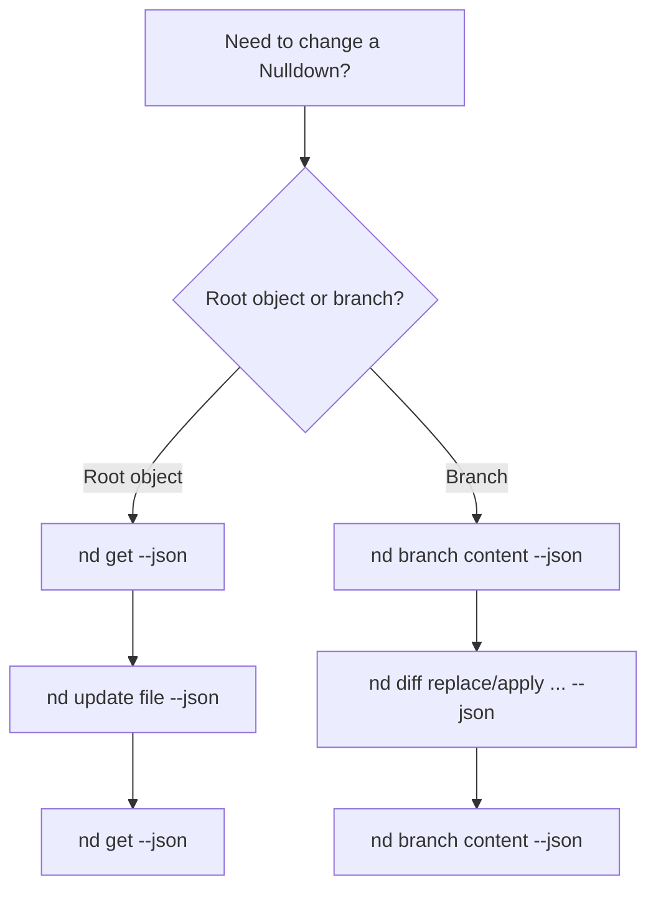

# Nulldown API Agent Skill Prompt

Use this prompt when an agent needs to read, create, edit, clone, promote, or document Nulldown drops. Prefer the Bun-native `nd` CLI. Use raw HTTP only as a fallback or when implementing a new client.

Published Nulldown docs:

- [Docs index](https://nulldown.app/d/r1Belg)
- [Agent skill prompt](https://nulldown.app/d/6p6ytx)
- [API reference](https://nulldown.app/d/q7RRSk)

## Mission

Operate Nulldown safely. Prefer small, reversible, revision-aware changes. Use metadata as state, markdown as renderable content, and branch diffs for atomic edits.

## Core Rules

1. Prefer `nd` commands over raw `curl`.
2. Always fetch before mutating.
3. Read canonical IDs, revisions, payload shape, and metadata before editing.
4. Store document state in `metadata`, not in markdown fences.
5. Use revision-safe root upserts through `nd update` unless the user explicitly accepts last-write-wins.
6. Prefer append-only branch diffs through `nd diff replace` or `nd diff apply` for branch edits.
7. Never assume `nd get` or `/api/get/:id` returns plaintext. It may return an encrypted `nmdn.drop.v1` envelope.
8. Never log bearer tokens, HMAC secrets, wrapped keys, private keys, decrypted keys, or decrypted private content.
9. Verify final state after every mutation.

## Base URL

Default production base URL:

```text
https://nulldown.app
```

Override with `--base <url>` or `ND_BASE_URL` for local or preview environments.

## CLI Basics

Run from the repo:

```bash
bun run nd -- --help
bun run nd -- doctor --json
```

For global installs:

```bash
bun install -g .
nd --help
```

Global installs store state in `~/.config/nulldown` by default.

Build a single-file executable when useful:

```bash
bun run cli:build
./dist/nulldown --help
```

Important global flags:

```text
--base <url>       API base URL
--json             stable JSON output
--token <token>    account bearer token
--account <id>     development account header
--client <id>      stable branch/diff client ID
--config <file>    JSON config file
--config-dir <dir> config directory, default ~/.config/nulldown
```

## Safe Read Workflow

```bash
bun run nd -- get <id> --json
```

Record:

| Value | Source |
| --- | --- |
| Canonical ID | `id` in CLI output or `X-Drop-Canonical-Id` over HTTP |
| Revision | `revision` in CLI output or `X-Drop-Revision`/`ETag` over HTTP |
| Payload type | `contentType` plus body shape |
| Metadata | `body.metadata` for plaintext drops |

For plaintext content only:

```bash
bun run nd -- get <id> --raw
```

If the body has `schema: "nmdn.drop.v1"`, it is encrypted. Do not claim to know plaintext content unless you can unlock it or read branch content.

## Creating A Drop

For simple docs:

```bash
bun run nd -- create doc.md --json
```

To set metadata:

```bash
bun run nd -- create doc.md --metadata '{"themeId":"system","allowedUrls":["nulldown.app"]}' --json
```

Response contains canonical `id` and share `url`.

## Updating A Drop In Place

Use root upsert only when you intend to replace the stored root object.

```bash
bun run nd -- get <id> --json
bun run nd -- update <canonicalId> doc.md --json
bun run nd -- get <canonicalId> --json
```

`nd update` fetches the current revision first and sends `expectedRevision`. If the server returns `revision_precondition_failed`, stop and re-read before retrying.

Use `--metadata` or `--metadata-file` to merge metadata changes into the existing metadata object:

```bash
bun run nd -- update <canonicalId> doc.md --metadata-file metadata.json --json
```

## Atomic Branch Editing

Use branch diffs when the task is to edit a branch or preserve an append-only edit stream.

Read current branch content:

```bash
bun run nd -- branch content <rootId> <branchId> --json
```

Replace branch content from a file. The CLI computes a minimal diff event, posts it, and verifies the materialized content:

```bash
bun run nd -- diff replace <rootId> --branch <branchId> --to-file edited.md --json
```

Attach event-level semantic metadata when the edit has meaning beyond raw text operations:

```bash
bun run nd -- diff apply <rootId> --branch <branchId> --metadata-file event-meta.json --insert 0:Hello --json
```

Post an ordered batch of semantic events:

```bash
bun run nd -- diff batch <rootId> --branch <branchId> --body-file batch.json --json
```

Metadata example:

```json
{
  "kind": "nullplug.invoke",
  "intent": "embed child plan",
  "pluginId": "nd",
  "args": { "id": "childDropId", "mode": "card" },
  "labels": ["plan"],
  "confidence": 0.9
}
```

Apply a small explicit edit:

```bash
bun run nd -- diff apply <rootId> --branch <branchId> --insert 0:Hello --json
```

Verify:

```bash
bun run nd -- branch content <rootId> <branchId> --json
```

## Branch Resolution

Resolve the branch for the current actor or client:

```bash
bun run nd -- branch resolve <dropId> --client <clientId> --json
```

List branches and snapshots:

```bash
bun run nd -- branch list <rootId> --json
bun run nd -- branch snapshots <rootId> <branchId> --json
```

## Promotion Workflow

Use promotion when branch content should become a new shareable drop.

```bash
bun run nd -- branch promote <rootId> <branchId> --token <account-session-token> --json
```

Promotion requires account auth and branch owner/writer permission.

## Metadata State Pattern

State belongs in the drop metadata object:

```json
{
  "metadata": {
    "stateContainer": "drop.metadata.uiState",
    "uiState": {
      "docType": "nulldown.ui.state.v1",
      "revision": 1,
      "activePanel": "overview"
    },
    "diffReaderHint": {
      "eventPolicy": "state-first",
      "recommendedReplay": [
        "read metadata.uiState",
        "apply metadata changes",
        "apply content ops",
        "render markdown"
      ]
    }
  }
}
```

Do not place `metadata` fenced blocks in markdown unless the user explicitly requests render-visible state.

## Nulldown Cards And Embeds

Use native `nd` blocks for Nulldown-to-Nulldown composition. They render as compact cards by default and do not iframe the app.

Fence-argument syntax:

````markdown
```nd(id="H2oXJR")
```
````

Body syntax:

````markdown
```nd
H2oXJR
```
````

To let Nulldown render embeds, include hostnames in `metadata.allowedUrls`.

Metadata example:

```json
{
  "metadata": {
    "allowedUrls": ["nulldown.app", "www.youtube.com", "img.shields.io"]
  }
}
```

Markdown embed block:

````markdown
```embed
https://nulldown.app/d/abc123
```
````

## Account Auth

Preferred authenticated calls use:

```bash
bun run nd -- <command> --token <account-session-token>
```

Development can use:

```bash
bun run nd -- <command> --account <account-id>
```

Only use the insecure account header when the environment is explicitly configured for it.

## Diff Auth

Provider diff writes can require HMAC credentials. Use the CLI flow:

```bash
bun run nd -- diff keygen --client <clientId>
bun run nd -- diff register <dropId> --token <account-session-token> --json
bun run nd -- diff token export
bun run nd -- diff sign <dropId> --body-file event.json --json
```

The CLI stores diff keys and credentials as a single base64url `ndauth.v1` token at `~/.config/nulldown/diff-auth.token` by default. Override with `--config-dir <dir>`, `ND_CONFIG_DIR`, `--diff-auth-token <token>`, or `ND_DIFF_AUTH_TOKEN`.

Move the token between machines or CI jobs:

```bash
TOKEN=$(bun run nd -- diff token export)
bun run nd -- diff token import "$TOKEN" --force
```

The token can contain the RSA private key and unwrapped HMAC secrets. Treat it like a password.

## Decision Tree



## HTTP Fallback

Use raw HTTP only if `nd` is unavailable or you are testing the wire protocol directly.

Read:

```bash
curl -i --fail-with-body 'https://nulldown.app/api/get/<id>'
```

Create:

```bash
curl -sS --fail-with-body 'https://nulldown.app/api/store' \
  -H 'Content-Type: application/json' \
  --data '{"content":"# Title\n","metadata":{"themeId":"system"}}'
```

Append diff event:

```bash
curl -sS --fail-with-body 'https://nulldown.app/api/diff/<rootId>?branchId=<branchId>' \
  -H 'Content-Type: application/json' \
  --data @event.json
```

## Common Mistakes To Avoid

- Do not update markdown content when the requested change is state-only. Put state in metadata.
- Do not use root upsert without a revision unless the user explicitly accepts last-write-wins.
- Do not give `/api/branches/.../content` links as user-facing share links; create or promote a drop and return `/d/:shortId`.
- Do not claim encrypted content is empty because `/api/get` returns ciphertext.
- Do not iframe Nulldown drops with `embed`; use `nd` card blocks for native composition.
- Do not forget `allowedUrls` for embed-heavy documents.
- Do not retry `revision_precondition_failed` blindly.

## Minimal Checklist

```text
1. nd get or nd branch content
2. compute smallest correct change
3. mutate with nd update or nd diff replace/apply
4. verify with nd get or nd branch content
5. return shareable /d/:shortId link when user asks for a link
```
